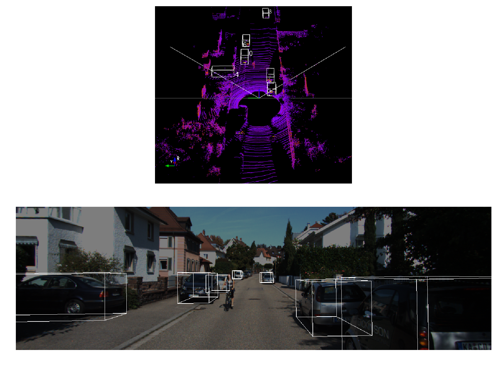
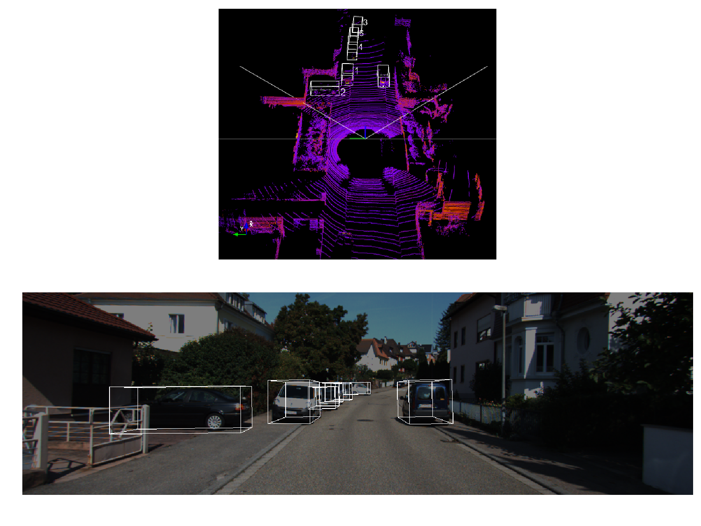
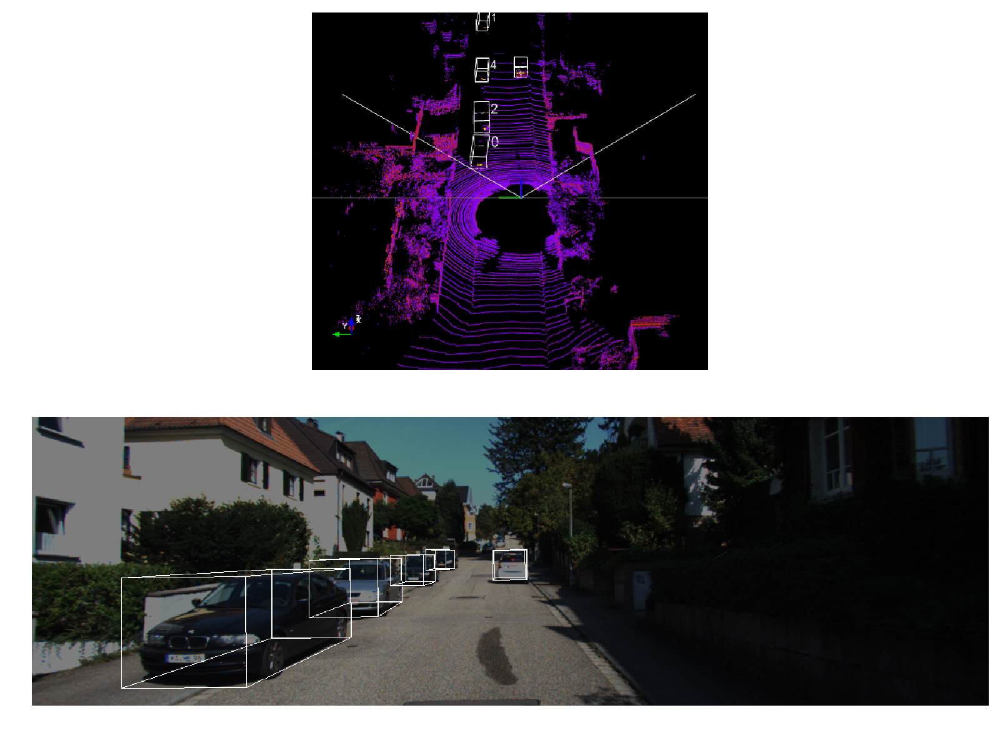

# Vehicle 3D Object Detection From RGB Images

This is an experimental Tensorflow implementation of MV3D - a ConvNet for object detection with Lidar and Mono-camera. 
And this work based on the code of [hengck23](https://github.com/hengck23/didi-udacity-2017) 

For details about MV3D please refer to the paper [Multi-View 3D Object Detection Network for Autonomous Driving](https://arxiv.org/abs/1611.07759) by [Xiaozhi Chen](https://arxiv.org/find/cs/1/au:+Chen_X/0/1/0/all/0/1), [Huimin Ma](https://arxiv.org/find/cs/1/au:+Ma_H/0/1/0/all/0/1), [Ji Wan](https://arxiv.org/find/cs/1/au:+Wan_J/0/1/0/all/0/1), [Bo Li](https://arxiv.org/find/cs/1/au:+Li_B/0/1/0/all/0/1), [Tian Xia](https://arxiv.org/find/cs/1/au:+Xia_T/0/1/0/all/0/1).


### Requirements: software

1. Requirements for Tensorflow 1.0  (see: [Tensorflow](https://www.tensorflow.org/))

2. Python packages you might not have: `cython`, `python-opencv`, `easydict`, `mayavi (for visualization)` 

### Requirements: hardware

1. For training the end-to-end version of Faster R-CNN with VGG16 and ResNet50, 8G of GPU memory is sufficient (using CUDNN)

### Installation 
1. 使用https://repo.continuum.io/archive/Anaconda3-4.3.1-Linux-x86_64.sh ；ref : https://www.continuum.io/downloads#linux install
```Shell
    conda create -n tensorflow python=3.5
    source activate tensorflow
    conda install -c menpo opencv3=3.2.0
    conda install matplotlib simplejson pandas

    cuda install: https://developer.nvidia.com/cuda-downloads

    按照python35 tensorflow gpu: ref https://www.tensorflow.org/install/install_linux 安装这里要求的cudnn版本 https://developer.nvidia.com/rdp/cudnn-download
    pip install --ignore-installed --upgrade https://storage.googleapis.com/tensorflow/linux/gpu/tensorflow_gpu-1.0.1-cp35-cp35m-linux_x86_64.whl
    
    conda install -c menpo mayavi
    conda install pyqt=4
    pip install easydict
    pip install pillow

    roi_pooling.so不同机器需重新编译；
    cd $MV3D/net/roipooling_op/
    目录下有make.sh 编译;查看 make.sh 文件；使用 /usr/local/cuda/bin/nvcc 80版本nvcc编译;
```

2. Downloads KITTI object datasets.
```Shell
 % Specify KITTI data path so that the structure is like
 % {kitti_dir}/object/training/image_2
 %                            /image_3
 %                            /calib
 %                            /lidar_bv
 %							 /velodyne   
 % {kitti_dir}/object/testing/image_2
 %                           /image_3
 %                           /calib
 %                           /lidar_bv
 %							/velodyne
```

3. Make Lidar top View data
%Edit your data path:
```shell
vim $MV3D/net/common.py:

    kitti_dir = "{kitti_dir}/object/training"
    train_data_root= 'your path to save the top view data'  
```
%Make data
```shell
cd $MV3D/data
python generate_top_view_data.py
```
% Generate groundtruth file
```shell
cd $MV3D/data
python generate_gt.py

```

4. Download pre-trained ImageNet models
Download the pre-trained ImageNet models [tensorflow checkpoint vgg16 and ResNet V1 50](https://github.com/tensorflow/models/tree/master/slim)
```Shell
    mv resnet_v1_50.ckpt $MV3D/outputs/check_points/resnet_v1_50.ckpt
    mv vgg_16.ckpt $MV3D/outputs/check_points/vgg_16.ckpt
```

5. Run script to train model 

```Shell
 cd $MV3D
 python ./tools/train_ResNet_vgg_double_up_c.py
```
DEVICE is either cpu/gpu

### Examples

Image and corresponding Lidar map 

1.



2.



3.



### References

[Lidar Birds Eye Views](http://ronny.rest/blog/post_2017_03_26_lidar_birds_eye/)

[part.2: Didi Udacity Challenge 2017 — Car and pedestrian Detection using Lidar and RGB](https://medium.com/@hengcherkeng/part-1-didi-udacity-challenge-2017-car-and-pedestrian-detection-using-lidar-and-rgb-fff616fc63e8)

[Faster_RCNN_TF](https://github.com/smallcorgi/Faster-RCNN_TF)

[Faster R-CNN caffe version](https://github.com/rbgirshick/py-faster-rcnn)

[TFFRCNN](https://github.com/CharlesShang/TFFRCNN)

